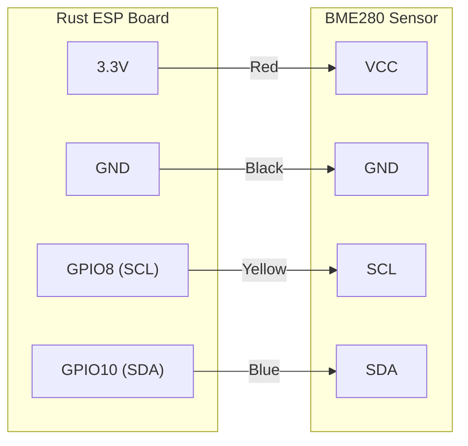
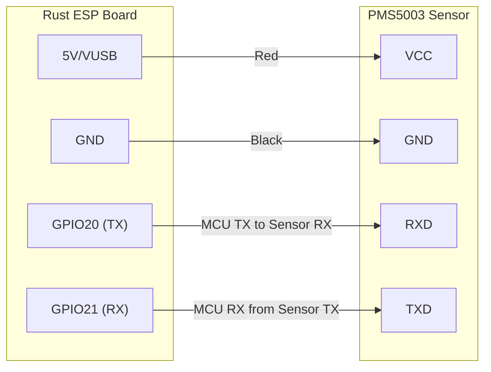
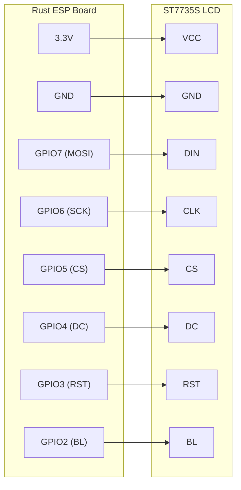
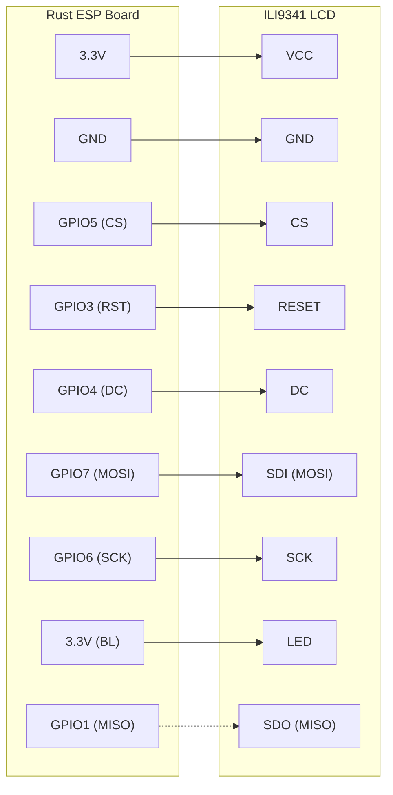
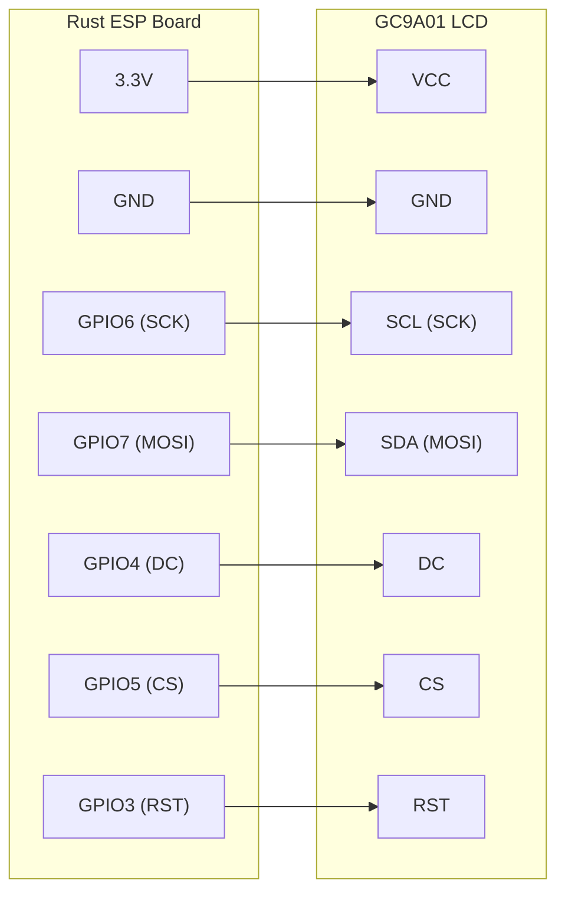

# esp-rust-board-discovery

Embedded Rust with Rust ESP Board (ESP32-C3-DevKit-RUST-1)

## About

This project contains examples and tutorials for programming the Rust ESP Board (ESP32-C3-DevKit-RUST-1) using embedded Rust with the `esp-hal` hardware abstraction layer.

## Hardware

**Board:** ESP32-C3-DevKit-RUST-1 (Rust ESP Board)

- **MCU:** ESP32-C3 (RISC-V single-core processor)
- **On-board peripherals:**
  - WS2812 RGB LED on GPIO2
  - SHTC3 temperature/humidity sensor (I2C)
  - ICM42670p 6-axis IMU (I2C)
  - User button on GPIO9
- **I2C pins:**
  - SDA: GPIO10
  - SCL: GPIO8

## Examples

### Basic Examples

#### blinky

Blinks the on-board LED to verify your setup is working.

```bash
cargo run --example blinky
```

#### button

Reads the user button state and prints to console.

```bash
cargo run --example button
```

#### button-interrupt

Demonstrates interrupt-driven button handling for more efficient code.

```bash
cargo run --example button-interrupt
```

### WS2812 RGB LED2

#### rgBlinky

Controls the on-board WS2812 addressable RGB LED on GPIO2. Displays a smooth rainbow animation cycling through all colors using HSV color space with gamma correction.

```bash
cargo run --example rgBlinky
```

**Features:**

- Uses ESP32 RMT peripheral for precise timing
- HSV to RGB color conversion
- Gamma correction for better color appearance
- Configurable brightness (default: 10/255)

### I2C Examples

#### i2c_scan

Scans the I2C bus for connected devices and prints their addresses. Useful for debugging I2C connections.

```bash
cargo run --example i2c_scan
```

**Expected devices on the Rust ESP Board:**

- `0x44` - SHTC3 temperature/humidity sensor
- `0x68` - ICM42670p IMU

#### shtc3

Reads temperature and humidity from the on-board SHTC3 sensor and prints values continuously.

```bash
cargo run --example shtc3
```

**Output:** Temperature in °C and humidity in %

#### icm42670p

Demonstrates reading both the SHTC3 sensor and the ICM42670p gyroscope simultaneously using shared I2C bus.

```bash
cargo run --example icm42670p
```

**Output:** Temperature, humidity, and gyroscope X/Y/Z values

#### bme280_i2c

Reads temperature, humidity, and atmospheric pressure from an external BME280 sensor. This is a popular environmental sensor that measures all three parameters in one device.

This example is configured for the **Adafruit BME280** breakout board connected via **Qwiic/STEMMA QT** cable.

```bash
cargo run --example bme280_i2c
```

**Hardware:**

- Sensor: Adafruit BME280 Temperature Humidity Pressure Sensor
- Connection: Qwiic/STEMMA QT cable (plug and play I2C connection)

**Wiring with Qwiic/STEMMA QT:**

Simply connect the Qwiic/STEMMA QT cable between the board and sensor - no separate wires needed!

```text
BME280 Pin -> Rust ESP Board
----------    --------------
GND (black) -> GND
VCC (red)   -> 3.3V
SCL (yellow)-> GPIO8
SDA (blue)  -> GPIO10
```



**I2C Address:**

- Adafruit BME280: `0x77` (configured in code)
- Generic modules: Often `0x76` (change to `BME280::new_primary()` in code)

**Output:** Temperature in °C, humidity in %, and atmospheric pressure in hPa

#### hs3003_i2c

Reads temperature and humidity from the Renesas HS3003 sensor using a custom driver implementation. This example is configured for the **Arduino Modulino Thermo** connected via **Qwiic/STEMMA QT** cable.

```bash
cargo run --example hs3003_i2c
```

**Hardware:**

- Sensor: Arduino Modulino Thermo (Renesas HS3003)
- Connection: Qwiic/STEMMA QT cable (plug and play I2C connection)

**Wiring with Qwiic/STEMMA QT:**

Simply connect the Qwiic/STEMMA QT cable between the board and Modulino Thermo - no separate wires needed!

```text
Modulino Pin -> Rust ESP Board
------------    --------------
GND (black)  -> GND
VCC (red)    -> 3.3V
SCL (yellow) -> GPIO8
SDA (blue)   -> GPIO10
```

**I2C Address:**

- HS3003: `0x44` (fixed address)

**Features:**

- 14-bit resolution for temperature and humidity
- Temperature: -40°C to +125°C (±0.2°C accuracy)
- Humidity: 0-100% RH (±1.5% accuracy)
- Custom driver implementation (no external crate needed)

**Output:** Temperature in °C and humidity in %

#### bh1750_i2c

Reads ambient light levels in lux from a BH1750 digital light sensor. This example is configured for the **Adafruit BH1750** breakout board connected via **Qwiic/STEMMA QT** cable.

```bash
cargo run --example bh1750_i2c
```

**Hardware:**

- Sensor: Adafruit BH1750 Light Sensor
- Connection: Qwiic/STEMMA QT cable (plug and play I2C connection)

**Wiring with Qwiic/STEMMA QT:**

Simply connect the Qwiic/STEMMA QT cable between the board and sensor - no separate wires needed!

```text
BH1750 Pin  -> Rust ESP Board
----------     --------------
GND (black) -> GND
VCC (red)   -> 3.3V
SCL (yellow)-> GPIO8
SDA (blue)  -> GPIO10
```

**I2C Address:**

- Adafruit BH1750: `0x23` (ADDR pin to GND, default)
- Alternative: `0x5C` (ADDR pin to VCC)

**Features:**

- Wide range and high resolution (1-65535 lx)
- Spectral response close to human eye
- Three resolution modes: Low (4 lx), High (1 lx), High2 (0.5 lx)
- Automatic mode cycling demonstration
- Low power consumption

**Output:** Light level in lux, cycling through different resolution modes

#### ltr559_i2c

Reads ambient light (lux) and proximity data from an LTR559 sensor. This example is configured for the **Pimoroni Enviro+ FeatherWing**.

```bash
cargo run --example ltr559_i2c
```

**Hardware:**

- Sensor: LITE-ON LTR559 (on Pimoroni Enviro+ FeatherWing)
- Connection: I2C (configured for ESP32-C3)
- I2C Address: `0x23` (default)

**Wiring:**

- **SDA:** GPIO 10
- **SCL:** GPIO 8
- **VCC:** 3.3V
- **GND:** GND

**Features:**

- Reads Proximity and Light (Lux) data
- Custom driver implementation (no external crate needed)
- Lux calculation using Pimoroni's formula
- Verified gain settings against reference drivers

**Output:** Proximity value and Light level in Lux

#### modulino_pixels_i2c

Controls 8 RGB LEDs on the Arduino Modulino Pixels module. This example is configured for the **Arduino Modulino Pixels** connected via **Qwiic/STEMMA QT** cable.

```bash
cargo run --example modulino_pixels_i2c
```

**Hardware:**

- Module: Arduino Modulino Pixels (ABX00109)
- LEDs: 8x LC8822-2020 addressable RGB LEDs
- MCU: STM32C011F4 (handles LED control over I2C)
- Connection: Qwiic/STEMMA QT cable (plug and play I2C connection)

**Wiring with Qwiic/STEMMA QT:**

Simply connect the Qwiic/STEMMA QT cable between the board and Modulino Pixels - no separate wires needed!

```text
Modulino Pin -> Rust ESP Board
------------    --------------
GND (black)  -> GND
VCC (red)    -> 3.3V
SCL (yellow) -> GPIO8
SDA (blue)   -> GPIO10
```

**I2C Address:**

- Modulino Pixels: `0x36` (7-bit addressing)
- Note: Some documentation shows `0x6C` (8-bit write address = 0x36 << 1)
- Address is configurable via software for multiple modules

**Protocol:**

- Each LED: 4 bytes [red, green, blue, 0xE0|brightness]
- RGB values: 0-255 each
- Brightness: 0-100 (mapped to 0-31 internally)
- Control bits: 0xE0 always set
- Total buffer: 32 bytes for 8 LEDs

**Features:**

- Individual control of 8 RGB LEDs
- Adjustable brightness per LED
- Full RGB color support
- Three demo animations:
  - Rainbow colors - All 8 LEDs in different colors
  - Knight Rider effect - Scanning LED with trailing glow
  - Color fade cycle - Smooth fading through colors

**Output:** Displays colorful LED animations

#### bme280alt_i2c

Reads temperature, humidity, and atmospheric pressure from a BME280 sensor at address `0x76`. This example is configured for the **Pimoroni Enviro+ FeatherWing** or other modules using the alternative I2C address.

```bash
cargo run --example bme280alt_i2c
```

**Hardware:**

- Sensor: Pimoroni Enviro+ FeatherWing (BME280)
- I2C Address: `0x76` (SDO to GND)

#### bmp580_i2c

Reads temperature and atmospheric pressure from the Bosch BMP580 sensor using a custom local driver implementation. This example is configured for the **Adafruit BMP580** connected via **Qwiic/STEMMA QT** cable.

```bash
cargo run --example bmp580_i2c
```

**Hardware:**

- Sensor: Adafruit BMP580 (High-performance barometric pressure sensor)
- Connection: Qwiic/STEMMA QT cable (plug and play I2C connection)

**Wiring with Qwiic/STEMMA QT:**

Simply connect the Qwiic/STEMMA QT cable between the board and BMP580 - no separate wires needed!

```text
BMP580 Pin  -> Rust ESP Board
-----------    --------------
GND (black) -> GND
VCC (red)   -> 3.3V
SCL (yellow)-> GPIO8
SDA (blue)  -> GPIO10
```

**I2C Address:**

- Adafruit BMP580: `0x47` (default)
- Alternative: `0x46` (SDA pulled to GND/logic low)

**Features:**

- High precision pressure sensing (±0.5 hPa accuracy)
- Temperature sensing
- Custom driver implementation (no external crate needed)
- Normal power mode with 50Hz ODR (default)
- 4x pressure oversampling for low noise

**Output:** Atmospheric pressure in hPa and temperature in °C

#### bme680_i2c

Reads temperature, humidity, atmospheric pressure, and gas resistance (VOCs) from a BME680 or BME688 sensor. This example is configured for the **Adafruit BME688** breakout board connected via **Qwiic/STEMMA QT** cable.

```bash
cargo run --example bme680_i2c
```

**Hardware:**

- Sensor: Adafruit BME688 Temperature Humidity Pressure Gas Sensor
- Connection: Qwiic/STEMMA QT cable (plug and play I2C connection)

**Wiring with Qwiic/STEMMA QT:**

Simply connect the Qwiic/STEMMA QT cable between the board and sensor - no separate wires needed!

```text
BME688 Pin  -> Rust ESP Board
-----------    --------------
GND (black) -> GND
VCC (red)   -> 3.3V
SCL (yellow)-> GPIO8
SDA (blue)  -> GPIO10
```

**I2C Address:**

- Adafruit BME688: `0x77` (configured in code as `DeviceAddress::Secondary`)
- Alternative: `0x76` (change to `DeviceAddress::Primary` in code)

**Features:**

- Temperature sensing (-40°C to +85°C)
- Humidity sensing (0-100% RH)
- Pressure sensing (300-1100 hPa)
- Gas resistance measurement for VOC detection (volatile organic compounds)
- Uses `bosch-bme680` crate for full sensor support
- Gas resistance ranges from ~1kΩ (polluted air) to ~100MΩ (clean air)

**Output:** Temperature in °C, humidity in %, atmospheric pressure in hPa, and gas resistance in Ohms

#### sgp30_i2c

Reads eCO2 (equivalent CO2) and TVOC (Total Volatile Organic Compounds) from an SGP30 air quality sensor. This example is configured for the **Adafruit SGP30** breakout board connected via **Qwiic/STEMMA QT** cable.

```bash
cargo run --example sgp30_i2c
```

**Hardware:**

- Sensor: Adafruit SGP30 Air Quality Sensor Breakout - VOC and eCO2
- Connection: Qwiic/STEMMA QT cable (plug and play I2C connection)

**Wiring with Qwiic/STEMMA QT:**

Simply connect the Qwiic/STEMMA QT cable between the board and sensor - no separate wires needed!

```text
SGP30 Pin   -> Rust ESP Board
-----------    --------------
GND (black) -> GND
VCC (red)   -> 3.3V
SCL (yellow)-> GPIO8
SDA (blue)  -> GPIO10
```

**I2C Address:**

- SGP30: `0x58` (fixed address, cannot be changed)

**Features:**

- eCO2 (equivalent CO2) measurement: 400-60000 ppm
- TVOC (Total Volatile Organic Compounds) measurement: 0-60000 ppb
- Dynamic baseline compensation algorithm
- On-chip humidity compensation support
- Baseline values can be stored and restored for faster warm-up
- Uses `sgp30` crate for full sensor support

**Warm-up Timeline:**

- First 15-20 seconds (15-20 measurements): Fixed baseline values (400 ppm CO2, 0 ppb TVOC)
- Next 20 minutes (~1200 measurements): Sensor settling period for reliable readings
- First 12 hours (~43,200 measurements): Baseline calibration period
- Brand new sensors: 48-hour factory burn-in recommended

**Important Notes:**

- The sensor must be read every 1 second to maintain proper baseline compensation
- Expose sensor to fresh outdoor air for 10 minutes to help establish baseline
- Save baseline values after 12+ hours of operation for faster subsequent startups
- Test VOC detection by breathing near sensor or using hand sanitizer
- The example shows changes in real-time and displays baseline values every 5 minutes

**Output:** eCO2 in ppm (parts per million) and TVOC in ppb (parts per billion), with change detection and status updates

### Analog Examples

#### mics6814

Reads values from the MICS6814 analog gas sensor (Oxidising, Reducing, and NH3 channels). Configured for the **Pimoroni Enviro+ FeatherWing**.

```bash
cargo run --example mics6814
```

**Hardware:**

- Sensor: MICS6814 (on Pimoroni Enviro+ FeatherWing)
- Connection: Analog inputs (configured for ESP32-C3 ADC)

#### gp2y1010au0f_dust

Reads dust density (PM2.5/PM10 particles) from the Sharp GP2Y1010AU0F optical dust sensor. This example is configured for the **Waveshare Dust Sensor** module.

```bash
cargo run --example gp2y1010au0f_dust
```

**Hardware:**

- Sensor: Waveshare Dust Sensor (Sharp GP2Y1010AU0F)
- Connection: 4-wire interface (VCC, GND, AOUT, ILED)
- Voltage: 5V (sensor requires 4.5V-5.5V)

**Wiring:**

```text
Waveshare Dust Sensor -> ESP32-C3 Rust Board
----------------------   ---------------------
VCC (red)             -> 5V/VUSB (via 220µF capacitor to GND)
GND (black)           -> GND
AOUT (yellow)         -> GPIO0 (ADC input)
ILED (blue)           -> GPIO1 (digital output to 150Ω resistor to 5V)
```

**Required External Components:**

- **150Ω resistor** between ILED and 5V (current limiting for LED)
- **220µF capacitor** between VCC and GND (power stabilization)

**How it Works:**

The GP2Y1010AU0F uses an infrared LED and photodetector to measure dust particles:
1. LED is pulsed ON for 0.32ms every 10ms
2. After 0.28ms delay, the analog output is sampled
3. Dust particles reflect LED light, increasing the output voltage
4. Output voltage is proportional to dust density (0.5V per 0.1mg/m³)

**Sensor Characteristics:**

- Clean air: ~0V to 0.6V
- Dusty air: 0.6V to 3.5V
- Sensitivity: 0.5V per 0.1mg/m³

**Air Quality Levels:**

- Good: < 0.035 mg/m³
- Moderate: 0.035 - 0.075 mg/m³
- Poor: > 0.075 mg/m³

**Output:** ADC raw value, voltage, dust density in mg/m³, running average, and air quality assessment

### UART Examples

#### pms5003

Reads PM1.0, PM2.5, and PM10 air quality data from a PMS5003 sensor connected via UART.

```bash
cargo run --example pms5003
```

**Wiring:**

- Sensor TX -> GPIO21 (RX)
- Sensor RX -> GPIO20 (TX)



### Wi-Fi Examples

#### http_client

Connects to a Wi-Fi network and performs a simple HTTP GET request.

```bash
cargo run --example http_client
```

**Configuration:**

- Requires `SSID` and `PASSWORD` environment variables to be set at compile time.

### Display Examples (SSD1306 OLED - I2C)

These examples require an external 128x64 SSD1306 OLED display connected via I2C.

#### Wiring for SSD1306 Display

```text
Display Pin -> Rust ESP Board
-----------    --------------
GND (black) -> GND
VCC (red)   -> 3.3V
SCL (yellow)-> GPIO8
SDA (green) -> GPIO10
```

#### ssd1306

Displays a Rust logo image on the OLED screen.

```bash
cargo run --example ssd1306
```

**Features:**

- 1-bit black and white graphics
- Buffered rendering
- Static image display

#### ssd1306_text

Demonstrates text rendering and drawing shapes on the OLED display.

```bash
cargo run --example ssd1306_text
```

**Features:**

- Text rendering with built-in fonts
- Drawing primitives (lines, rectangles, circles)
- Shows "Rust ESP Board Demo" with graphics

### Display Examples (SH1107 OLED - I2C)

These examples require an Adafruit 128x64 OLED FeatherWing (SH1107) connected via I2C.

**Hardware:** [Adafruit 128x64 OLED FeatherWing](https://www.adafruit.com/product/4650)

#### Wiring for Adafruit OLED FeatherWing

```
Display Pin -> Rust ESP Board
-----------    --------------
GND         -> GND
3V          -> 3.3V
SCL         -> GPIO8
SDA         -> GPIO10
```

#### adafruit_feather_sh1107_text

Demonstrates text rendering and drawing shapes on the SH1107 OLED using a local driver implementation.

```bash
cargo run --example adafruit_feather_sh1107_text
```

**Features:**

- Custom local driver (no external crate dependency issues)
- 128x64 pixel resolution
- Text and shape rendering using `embedded-graphics`
- Safe for USB debugging (uses I2C, not SPI)

#### adafruit_feather_sh1107

Displays two 64x64 bitmap images side-by-side using the local driver.

```bash
cargo run --example adafruit_feather_sh1107
```

**Features:**

- Displays `ferris64x64bw.bmp` (converted from RGB to 1-bit BMP)
- Displays `rust.raw` (raw 1-bit image data)
- Demonstrates loading images with `tinybmp` and `ImageRaw`
- Includes `convert_ferris.py` script for converting images

### Display Examples (ST7735S LCD - SPI)

These examples require a Waveshare 0.96 inch LCD module (80x160 pixels) with ST7735S controller connected via SPI.

**Note:** For round 240x240 displays, see the GC9A01 examples below.

#### Wiring for Waveshare 0.96" LCD Module

```
LCD Pin -> Rust ESP Board
-------    ----------------------
VCC     -> 3.3V
GND     -> GND
DIN     -> GPIO7  (MOSI)
CLK     -> GPIO6  (SCK)
CS      -> GPIO5  (Chip Select)
DC      -> GPIO4  (Data/Command)
RST     -> GPIO3  (Reset)
BL      -> GPIO2  (Backlight)
```



**Pin Functions:**

- **VCC**: Power supply (3.3V)
- **GND**: Ground
- **DIN (MOSI)**: SPI data input - transmits pixel data
- **CLK (SCK)**: SPI clock - synchronizes data transmission
- **CS**: Chip select (active low) - enables the display
- **DC**: Data/Command select (Low=Command, High=Data)
- **RST**: Reset (active low) - resets the display controller
- **BL**: Backlight control (HIGH=on, LOW=off)

**SPI Configuration:**

- SPI Mode: 0 (CPOL=0, CPHA=0)
- Clock Speed: 26 MHz
- Display Resolution: 80x160 pixels (landscape mode)
- Color Format: RGB565 (16-bit color, 65,536 colors)

#### st7735s_spi

Displays Ferris and Rust logo images on the color LCD.

```bash
cargo run --example st7735s_spi
```

**Features:**

- Full RGB565 color support (16-bit, 65K colors)
- Displays raw RGB565 image format (Ferris)
- Displays BMP image format (Rust logo)
- Hardware SPI for fast rendering

#### st7735s_spi_text

Demonstrates text rendering and colorful shapes on the LCD display.

```bash
cargo run --example st7735s_spi_text
```

**Features:**

- Multiple font sizes (6x10, 9x15 bold)
- Text styling with colors and backgrounds
- Drawing colorful primitives (rectangles, circles, lines)
- Multiple colors: white, blue, yellow, green, red, orange
- Shows "Rust ESP Board" title with graphics

### Display Examples (ILI9341 TFT LCD - SPI)

These examples require an ILI9341 TFT LCD module (240x320 pixels) connected via SPI. This is a common rectangular display used in many projects.

**Hardware:** 2.8" TFT SPI 240x320 V1.2 Display Module

This module includes a resistive touchscreen (T_CLK, T_CS, T_DIN, T_DO, T_IRQ pins) which is not used in these basic display examples.

#### Wiring for 2.8" TFT SPI 240x320 V1.2 Module

```
LCD Pin     -> Rust ESP Board
----------     ----------------------
VCC         -> 3.3V
GND         -> GND
CS          -> GPIO5  (Chip Select)
RESET       -> GPIO3  (Reset)
DC          -> GPIO4  (Data/Command)
SDI (MOSI)  -> GPIO7  (SPI MOSI/Data)
SCK         -> GPIO6  (SPI Clock)
LED         -> 3.3V  (Backlight)
SDO (MISO)  -> GPIO1  (optional)

Touchscreen pins (not connected in these examples):
T_CLK       -> (not used)
T_CS        -> (not used)
T_DIN       -> (not used)
T_DO        -> (not used)
T_IRQ       -> (not used)
```



**Pin Functions:**

- **VCC**: Power supply (3.3V or 5V depending on module)
- **GND**: Ground
- **CS**: Chip select for LCD (active low)
- **RESET**: Reset (active low)
- **DC**: Data/Command select (Low=Command, High=Data)
- **SDI (MOSI)**: SPI data input to display
- **SCK**: SPI clock
- **LED**: Backlight power (can connect to GPIO for PWM control)
- **SDO (MISO)**: SPI data output (optional, rarely needed)

**SPI Configuration:**

- SPI Mode: 0 (CPOL=0, CPHA=0)
- Clock Speed: 40 MHz (ILI9341 supports up to 60 MHz)
- Display Resolution: 240x320 pixels (portrait mode)
- Color Format: RGB565 (16-bit color, 65,536 colors)

#### ili9341_spi

Displays colorful text and Rust logo on the TFT LCD.

```bash
cargo run --example ili9341_spi
```

**Features:**

- Full RGB565 color support (16-bit, 65K colors)
- 240x320 pixel rectangular display
- Multiple colored text examples
- Displays BMP image format (Rust logo)
- High-speed 40 MHz SPI for fast rendering

#### ili9341_spi_text

Demonstrates comprehensive text rendering and colorful shapes on the LCD.

```bash
cargo run --example ili9341_spi_text
```

**Features:**

- Multiple font sizes (6x10, 9x15 bold, 10x20)
- Text styling with colors and backgrounds
- Drawing primitives (rectangles, circles, lines)
- Multiple colors: red, green, blue, yellow, cyan, magenta, white
- Title bar with background color
- Demonstrates rectangular layout for portrait display

#### zermatt

Displays a full-screen 320x240 landscape image of Zermatt on the ILI9341 display.

```bash
cargo run --example zermatt
```

**Features:**

- Full-screen landscape image display (320×240)
- Uses BMP format with tinybmp library
- Demonstrates landscape orientation (90° rotation)
- BGR color order for correct colors
- Includes Python script for JPEG to BMP conversion

**Image Conversion:**

```bash
python3 examples/convert_jpg_to_bmp.py examples/zermatt_320x240.jpg examples/zermatt_320x240.bmp
```

### Display Examples (GC9A01 Round LCD - SPI)

These examples require a GC9A01 round LCD module (240x240 pixels) connected via SPI. This is a circular display commonly used in smartwatches and circular gauge displays.

**Hardware:** UNI128-240240-RGB-7-V1.0 Display Module (7 pins)

**Important Note:** Despite the module having pins labeled **SCL/SDA**, this is an **SPI display**, not I2C! The presence of DC (Data/Command) and CS (Chip Select) pins confirms it's SPI. The pin labels mean:

- **SCL** = SPI Clock (same as SCK/SCLK)
- **SDA** = SPI Data (same as MOSI - Master Out Slave In)

#### Wiring for UNI128-240240-RGB-7-V1.0 Module

```
LCD Pin -> Rust ESP Board
-------    ----------------------
VCC     -> 3.3V
GND     -> GND
SCL     -> GPIO6  (SPI Clock)
SDA     -> GPIO7  (SPI MOSI/Data)
DC      -> GPIO4  (Data/Command)
CS      -> GPIO5  (Chip Select)
RST     -> GPIO3  (Reset)
```



**Pin Functions:**

- **VCC**: Power supply (3.3V)
- **GND**: Ground
- **SCL**: SPI clock (labeled SCL but it's actually SPI SCK)
- **SDA**: SPI data output (labeled SDA but it's actually SPI MOSI)
- **DC**: Data/Command select (Low=Command, High=Data)
- **CS**: Chip select (active low) - enables the display
- **RST**: Reset (active low) - resets the display controller

**Note:** This 7-pin module has no separate backlight control pin - the backlight is always on when powered.

**SPI Configuration:**

- SPI Mode: 0 (CPOL=0, CPHA=0)
- Clock Speed: 60 MHz (GC9A01 supports up to 62.5 MHz)
- Display Resolution: 240x240 pixels (round/circular)
- Color Format: RGB565 (16-bit color, 65,536 colors)
- Display Shape: Circular (visible area is round)

#### gc9a01_spi

Displays Ferris and Rust logo images on the round color LCD.

```bash
cargo run --example gc9a01_spi
```

**Features:**

- Full RGB565 color support (16-bit, 65K colors)
- 240x240 pixel round display
- Displays raw RGB565 image format (Ferris)
- Displays BMP image format (Rust logo)
- High-speed 60 MHz SPI for fast rendering
- Uses mipidsi driver for robust display control

#### gc9a01_spi_text

Demonstrates text rendering and colorful shapes optimized for the circular display.

```bash
cargo run --example gc9a01_spi_text
```

**Features:**

- Multiple font sizes (6x10, 9x15 bold, 10x20)
- Text styling with colors and backgrounds
- Circular shapes to match the round display form factor
- Drawing primitives optimized for circular layout
- Multiple colors: white, blue, yellow, green, red, cyan, magenta, orange
- Shows "GC9A01 Display" title with circular graphics
- Demonstrates lines radiating from center

## Dependencies

Key dependencies used in this project:

- **esp-hal** - Hardware abstraction layer for ESP32
- **embedded-hal** - Standard embedded traits
- **esp-hal-smartled** - WS2812/smart LED support via RMT
- **smart-leds** - Color manipulation and LED traits
- **ssd1306** - OLED display driver (I2C)
- **st7735-lcd** - ST7735S color LCD driver (SPI)
- **mipidsi** - Universal MIPI display driver (supports GC9A01 and many others)
- **display-interface-spi** - SPI display interface for mipidsi
- **embedded-graphics** - 2D graphics library for displays
- **tinybmp** - BMP image format support
- **shtcx** - SHTC3 sensor driver
- **icm42670** - ICM42670 IMU driver
- **bme280** - BME280 environmental sensor driver
- **bh1750** - BH1750 light sensor driver
- **defmt** - Efficient logging framework

## Building and Flashing

To build and flash any example:

```bash
# Build only
cargo build --example <example_name>

# Build and flash to device
cargo run --example <example_name>
```

## Development Setup

1. Install Rust and cargo
2. Install probe-rs: `cargo install probe-rs-tools --locked`
3. Add RISC-V target: `rustup target add riscv32imc-unknown-none-elf`
4. Clone this repository
5. Connect your Rust ESP Board via USB
6. Run examples with `cargo run --example <name>`

**Note:** This project uses probe-rs for flashing and debugging. The `.cargo/config.toml` is configured to use probe-rs as the runner.

## Resources

- [ESP-RS Book](https://docs.esp-rs.org/)
- [ESP-HAL Documentation](https://docs.esp-rs.org/esp-hal/)
- [BME280 Temperature, Humidity & Pressure](file:///Users/mordor/Src/rust/rust-embedded/esp-rust-board-discovery/examples/bme280_i2c.rs)
- [BME680/BME688 Temperature, Humidity, Pressure & Gas (VOC)](file:///Users/mordor/Src/rust/rust-embedded/esp-rust-board-discovery/examples/bme680_i2c.rs)
- [ICM42670 Accel/Gyro](file:///Users/mordor/Src/rust/rust-embedded/esp-rust-board-discovery/examples/icm42670p_i2c.rs)
- [Rust ESP Board GitHub](https://github.com/esp-rs/esp-rust-board)

## License

This project is licensed under the same terms as the Rust ESP Board examples.
